# Simpsons Encyclopedia App 📱

[](https://swift.org)
[](https://apple.com/ios)

This is a Simpsons Encyclopedia App, a project that provides comprehensive information about all characters and episodes.

## 📸 Screenshots

### Highlights
| Main Screen | Loading State | Character Details |
|:---:|:---:|:---:|
| 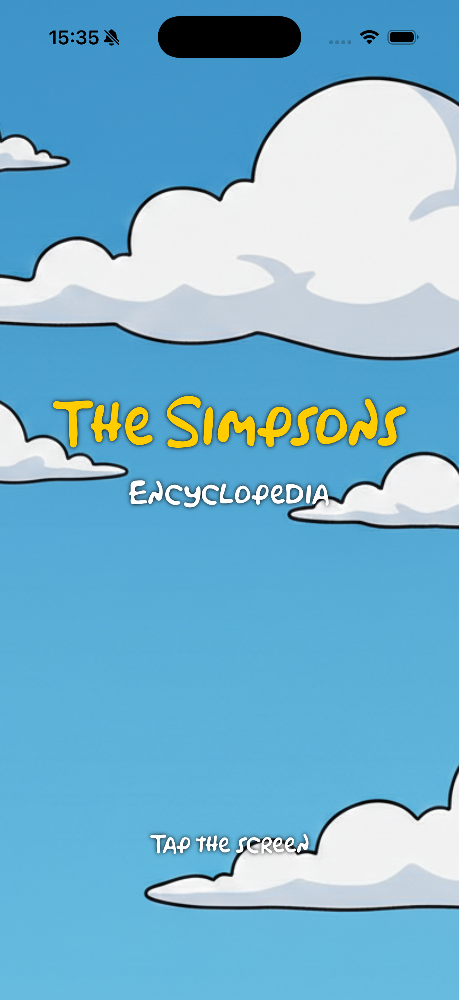 | 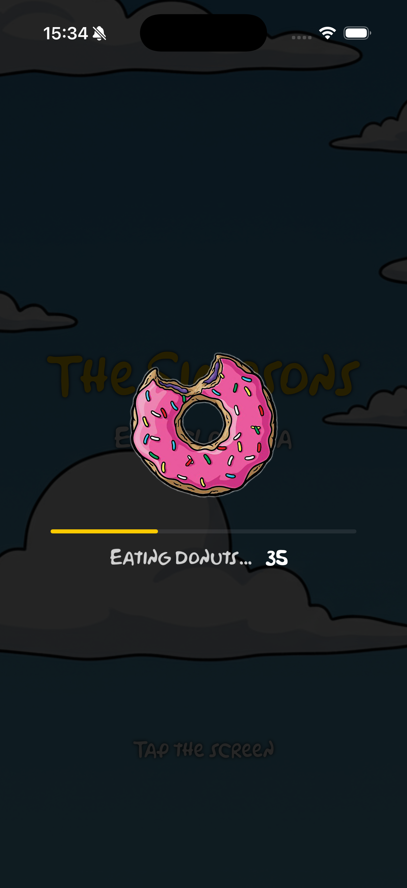 | 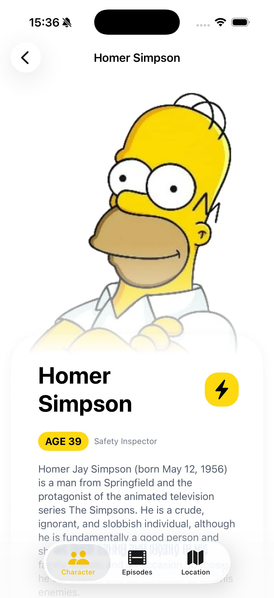 |

### Complete Gallery
Here you can see the app in action:

<p align="left">
  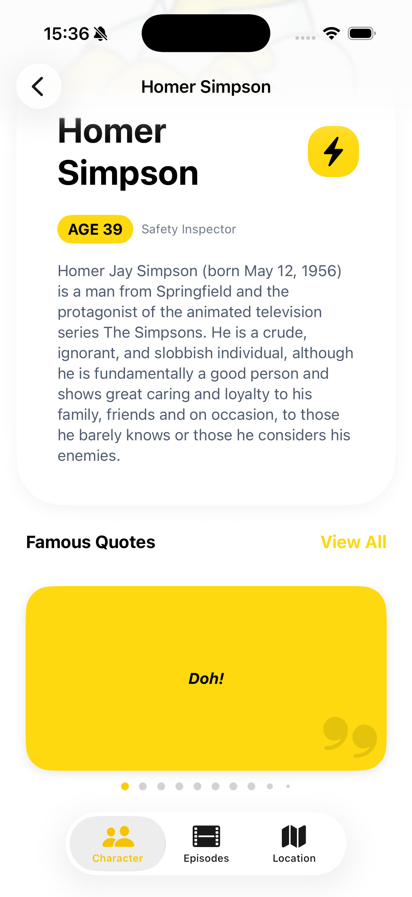
  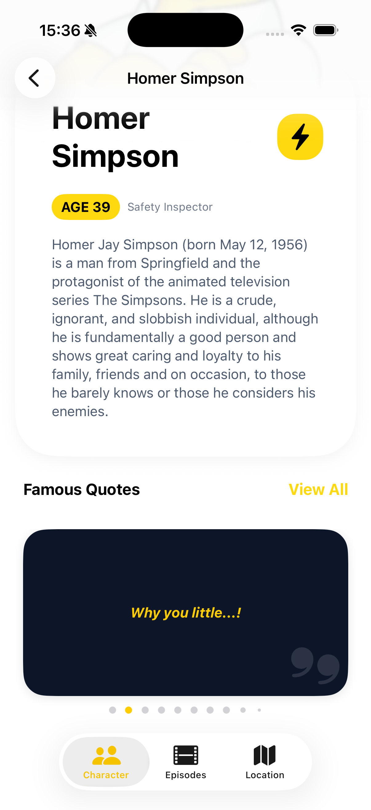
  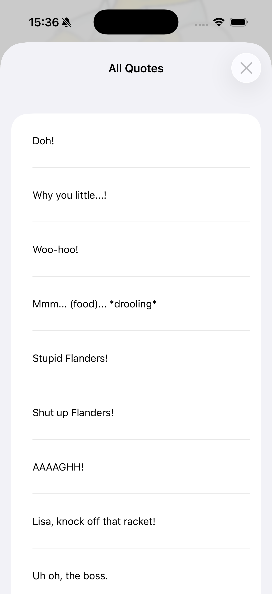
  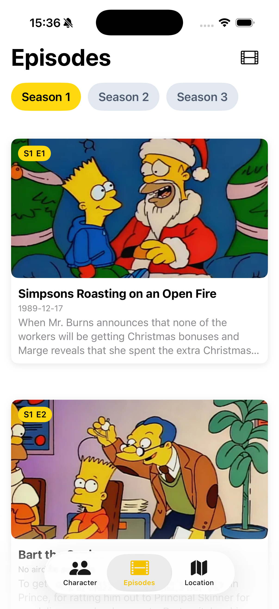
  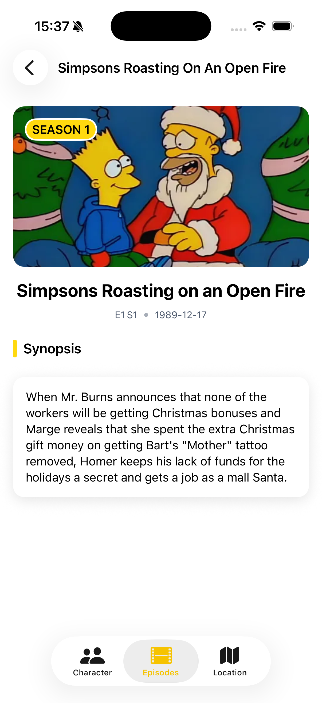
  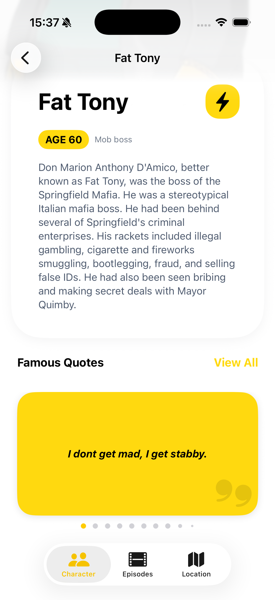
  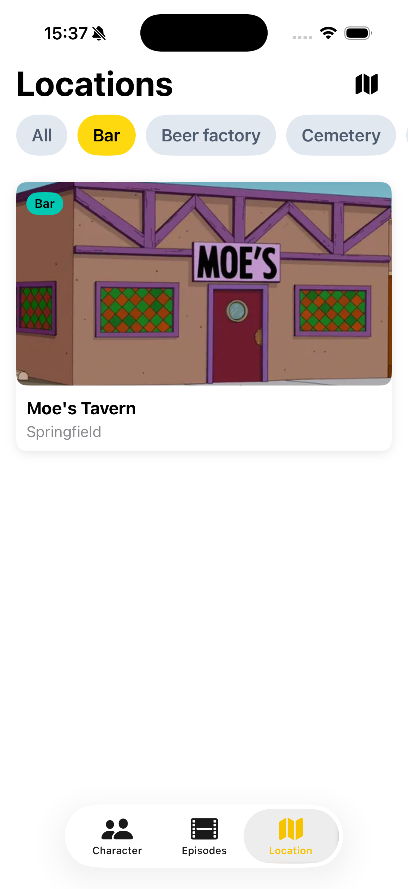
  
</p>

#### 🌙 Dark Mode & Extras
<p align="left">
  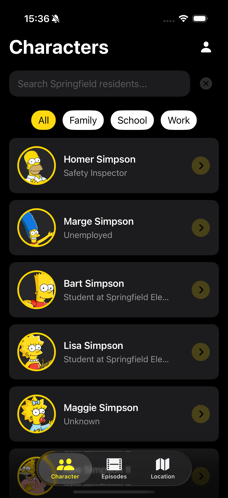
  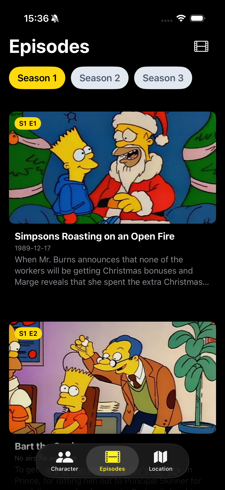
  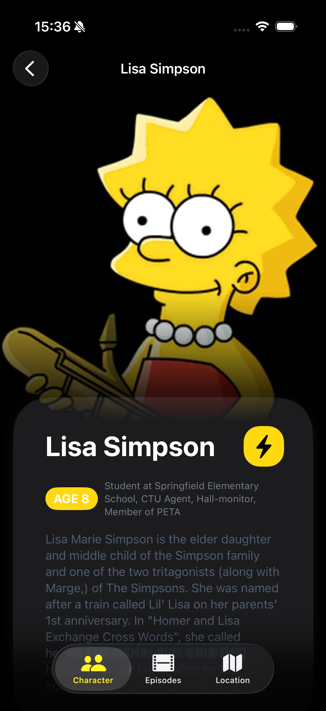
  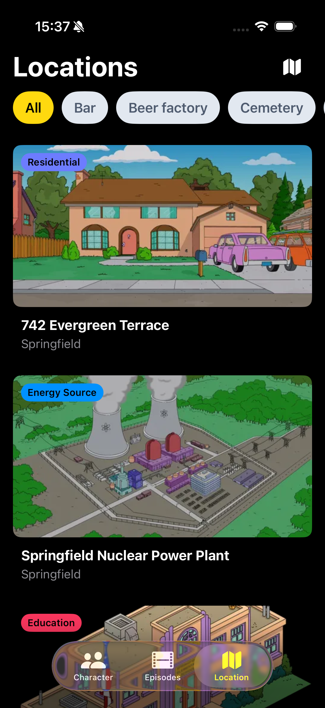
</p>

> [!TIP]
> 

## ✨ Features

- [x] Comprehensive Database: Explore a complete list of characters, episodes, and locations from The Simpsons universe.
- [x] Local Persistence: Powered by SwiftData to ensure your favorite characters and data are available offline.
- [x] Character Insights: Detailed view for each character, including their quotes, bio, and personal details.
- [x] Real-time Search: Quickly find your favorite character or episode with a dynamic search bar.
- [x] Dark Mode Support: Fully optimized for both Light and Dark appearances.

## 🛠 Technologies and Tools

- **Language:** Swift 6.0
- **Interface:** SwiftUI
- **Architeture:** MVVM + Model Container
- **Database:** SwiftData
- **Key Concepts:** @Model, @Query

## 🚀 How to run the project

1. Clone Repository:
   ```bash
   git clone https://github.com/keykenzo/SimpsonsApp.git 
